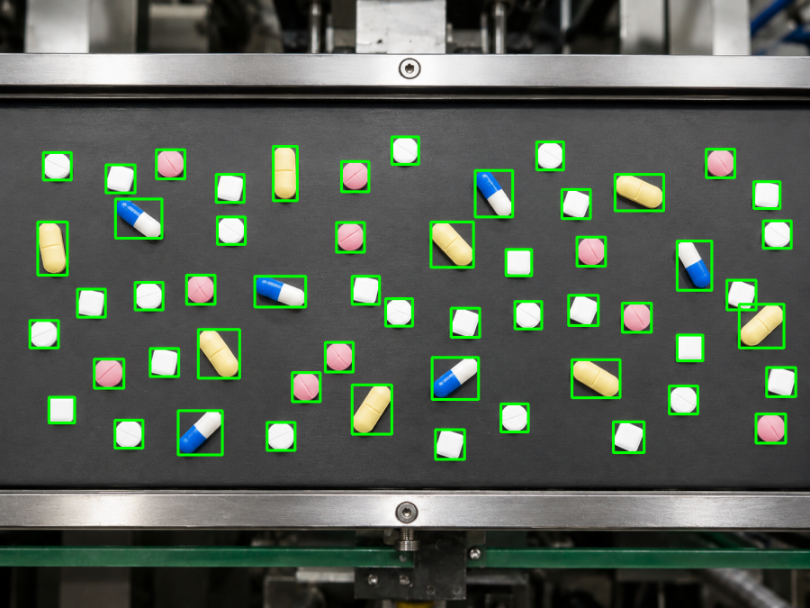

# TP N° 2 — Procesamiento de Imágenes I · TUIA

Trabajo práctico de la materia **Procesamiento de Imágenes I (IA 4.4)** de la
Tecnicatura Universitaria en Inteligencia Artificial — **UNR · FCEIA**.
Año 2026, 1° cuatrimestre.

El objetivo del TP es resolver dos problemas reales de visión por computadora
usando **únicamente técnicas clásicas de procesamiento de imágenes** (sin redes
neuronales ni modelos de machine learning): umbralización, morfología, espacios
de color, componentes conectados y análisis geométrico.

| | Problema 1 — Pastillas | Problema 2 — Patentes |
|---|---|---|
| **Entrada** | 1 foto de una cinta industrial | 12 fotos de autos |
| **Tarea** | Detectar, clasificar y contar pastillas | Detectar la patente y separar sus caracteres |
| **Resultado** | Cada pastilla rotulada con tipo e id | Patente recortada + 7 caracteres segmentados |

<p align="center">
  
  
</p>

---

## 📦 Problema 1 — Detección y clasificación de pastillas

Se parte de **una sola imagen** de una cinta transportadora con pastillas de
distintos colores y formas. El programa segmenta la cinta, aísla cada pastilla,
la **clasifica por tipo** (redonda blanca, redonda rosa, cuadrada, cápsula
amarilla, cápsula azul-blanca) y devuelve el conteo total junto con una imagen
rotulada.

➡️ **[Ver detalle del Problema 1](ejercicio_1/README.md)**

## 🚗 Problema 2 — Detección de placas patente

Se procesan **12 fotos de vehículos**, cada uno con su patente argentina modelo
Mercosur. Para cada imagen el programa **localiza la patente** buscando la fila
de 7 caracteres que cumple la geometría oficial, la recorta y **segmenta cada
carácter** por separado.

➡️ **[Ver detalle del Problema 2](ejercicio_2/README.md)**

---

## 🛠️ Tecnologías

- **Python 3.10+**
- **OpenCV** — procesamiento de imágenes
- **NumPy** — operaciones numéricas
- **Matplotlib** — visualización de resultados

## ▶️ Cómo ejecutarlo

El proyecto usa [**uv**](https://docs.astral.sh/uv/) como gestor de entornos
(durante el desarrollo `pip` nos daba errores de instalación en algunas PC).

```bash
# 1. Instalar dependencias
uv sync

# 2. Problema 1 — pastillas
uv run --directory ejercicio_1 python pastillas.py

# 3. Problema 2 — patentes
uv run --directory ejercicio_2 python patentes.py
```

> 💡 Cada script tiene un **modo debug** que muestra todas las etapas
> intermedias del procesamiento. Está documentado en el README de cada problema.

## 🌐 API HTTP (`api/`)

Las dos soluciones están además expuestas como **microservicio FastAPI**, para
poder consumirlas desde otra aplicación en vez de correr un script que abre
ventanas de matplotlib.

El código de visión **no se modificó**: `api/bridge.py` agrega `ejercicio_1/` y
`ejercicio_2/` al `sys.path`, fija el backend `Agg` de matplotlib (en un
servidor no hay display) y reexporta las funciones. Los endpoints solo orquestan
y serializan.

```bash
uv sync
uv run uvicorn api.main:app --reload --port 8001
# docs interactivas en http://localhost:8001/docs
```

| Método | Endpoint | Qué hace |
|---|---|---|
| `GET` | `/health` | Health check. |
| `GET` | `/pills/samples` · `/plates/samples` | Imágenes de ejemplo servidas por la API. |
| `GET` | `/{pills\|plates}/samples/{id}/image` | La imagen de ejemplo en crudo. |
| `POST` | `/{pills\|plates}/samples/{id}/analyze` | Procesa una muestra. |
| `POST` | `/{pills\|plates}/analyze` | Procesa una imagen subida (`multipart/form-data`). |

La respuesta trae el resultado **y el paso a paso**: cada etapa intermedia viene
como imagen en `data:` URL, así quien consume la API puede mostrar —y auditar—
cómo se llegó al número.

```jsonc
{
  "sample": { "id": "img_1", "label": "Vehiculo 1", "expected": "AG678UA" },
  "ms": 1536,
  "steps": [{ "id": "located", "title": "…", "caption": "…", "image": "data:image/jpeg;base64,…" }],
  "result": { "detected": true, "bbox": [520, 611, 141, 60], "chars": 7 }
}
```

### Variables de entorno

Ver `.env.example`. La relevante es **`CORS_ORIGINS`**: lista de orígenes
autorizados a consumir la API desde el navegador, separada por comas o en JSON.
Se normaliza sin barra final (el navegador manda el header `Origin` sin barra).
Si queda vacía, no se habilita ningún origen cruzado.

## 📁 Estructura del repositorio

```
tp_2/
├── ejercicio_1/          → Problema 1: pastillas
│   ├── pastillas.py
│   ├── img/pills.png
│   └── README.md
├── ejercicio_2/          → Problema 2: patentes
│   ├── patentes.py       → script principal
│   ├── placa.py          → detección de la patente
│   ├── caracteres.py     → segmentación de caracteres
│   ├── img/              → img_1.jpg … img_12.jpg
│   └── README.md
├── api/                  → microservicio FastAPI sobre los dos ejercicios
│   ├── main.py           → app y CORS por variable de entorno
│   ├── bridge.py         → reexporta el código de los ejercicios sin tocarlo
│   ├── imaging.py        → serialización de las imágenes del paso a paso
│   └── routes/           → pills.py · plates.py
├── assets/               → imágenes de los pasos (para los README)
└── README.md             → este archivo
```

## 👥 Integrantes

- Mendez Ignacio
- Ramirez Lucas
- Lujambio Valentín
