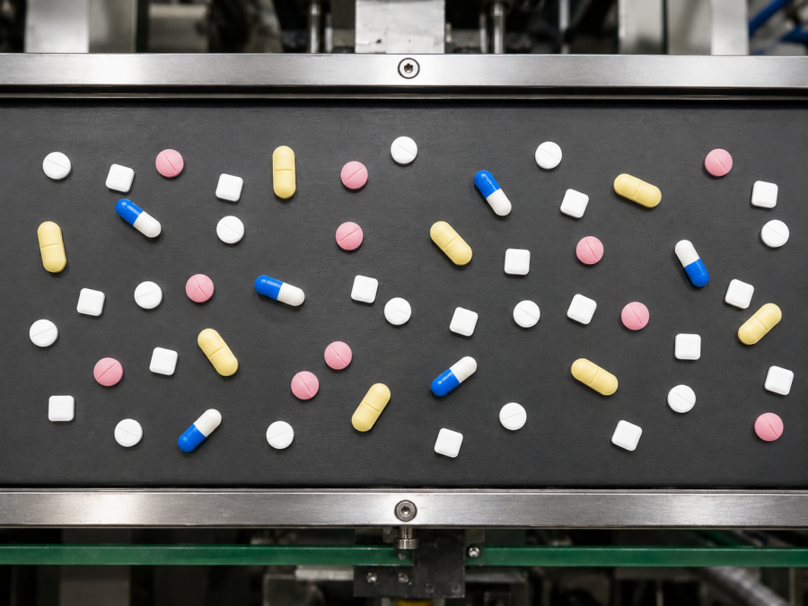
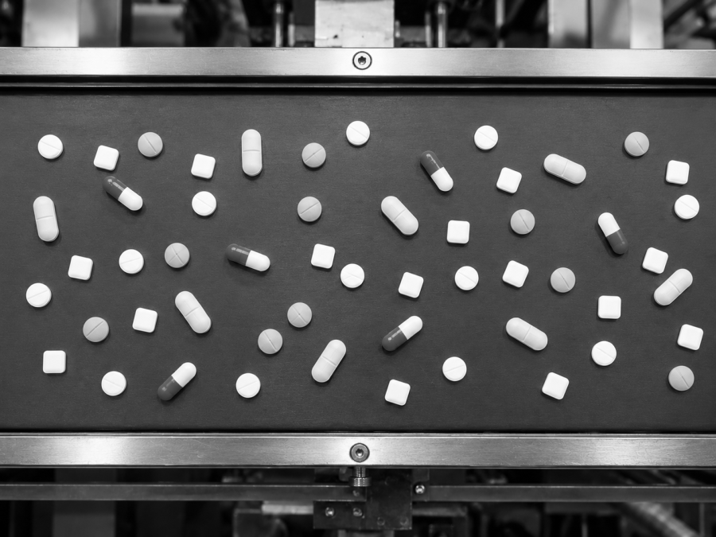
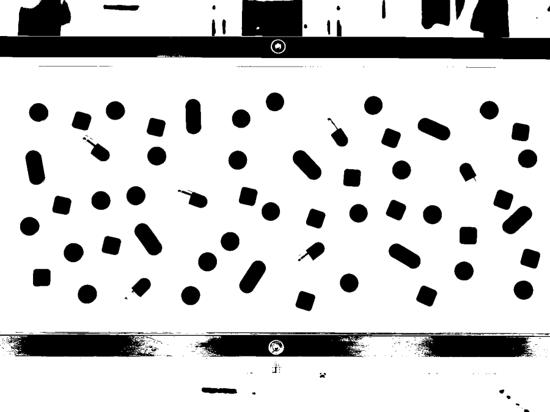
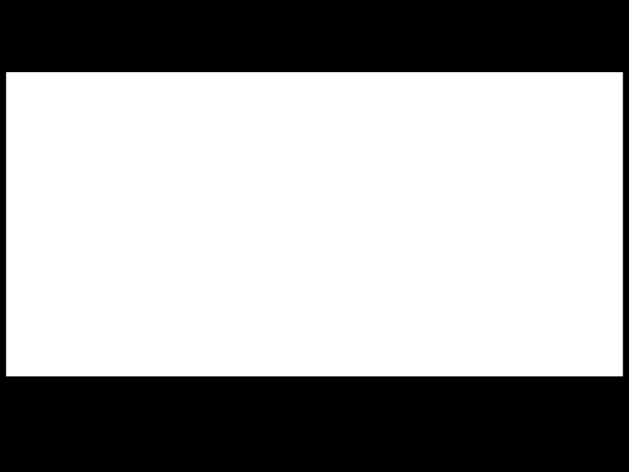
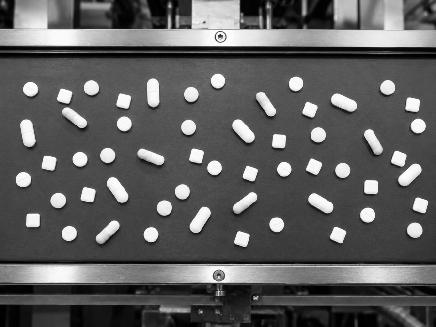
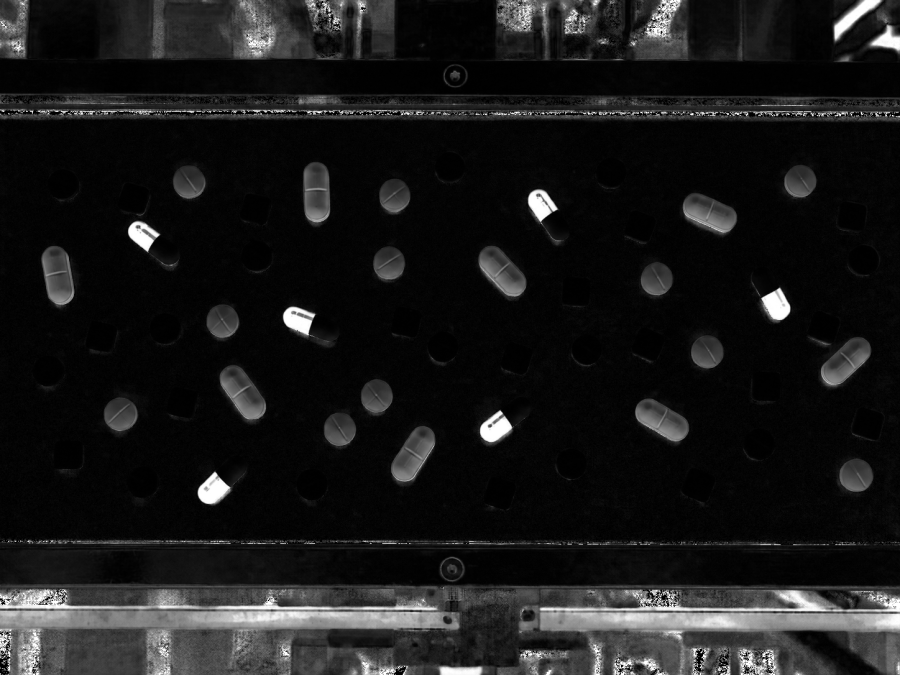
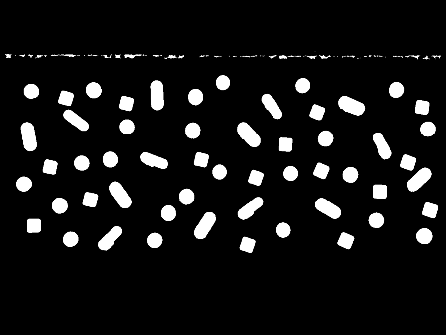

# Problema 1 — Detección y clasificación de pastillas 💊

Imaginá una **cinta transportadora de una fábrica** por la que pasan pastillas
de distintas formas, tamaños y colores. A partir de **una sola foto** queremos
que la computadora sea capaz de:

1. **Encontrar la cinta** dentro de la imagen.
2. **Detectar cada pastilla** por separado.
3. **Clasificarlas por tipo** y **contarlas**.
4. Devolver un informe por consola y una imagen con cada pastilla **rotulada**.

Todo esto se resuelve con procesamiento de imágenes clásico: nada de inteligencia
artificial entrenada, solo análisis de **color**, **forma** y **morfología**.

<p align="center">
  
  
</p>
<p align="center"><em>Izquierda: foto original · Derecha: pastillas detectadas, clasificadas y contadas.</em></p>

---

## 🧠 Cómo funciona, paso a paso

El procesamiento se divide en tres etapas (A, B y C en el código), más el reporte
final.

### A) Encontrar la cinta

Primero aislamos la cinta del fondo. Pasamos la imagen a **escala de grises** y
aplicamos el método de **Otsu** (umbralización automática) para separar la cinta
del fondo. Con operaciones **morfológicas** (apertura y cierre) limpiamos el
ruido y rellenamos los huecos que dejan las pastillas, y nos quedamos con el
**objeto más grande**: la cinta. Le agregamos un pequeño margen hacia adentro
para no tocar los bordes metálicos.

<p align="center">
  
  
  
</p>
<p align="center"><em>Grises → umbral de Otsu → máscara final de la cinta.</em></p>

### B) Detectar cada pastilla

Trabajamos en el espacio de color **HSV**, que separa el color (matiz) del brillo
y la saturación. Combinamos dos pistas:

- El canal **V (brillo)** detecta las pastillas claras sobre la cinta.
- El canal **S (saturación)** detecta las partes muy coloridas (clave para las
  cápsulas azul-blancas, donde el extremo blanco casi se confunde con la cinta).

Sumamos ambas detecciones, las recortamos al área de la cinta y limpiamos con
morfología. Finalmente, usando **componentes conectados**, separamos cada
pastilla y descartamos manchas demasiado chicas o tiras finas (artefactos del
borde).

<p align="center">
  
  
  
</p>
<p align="center"><em>Canal de brillo + canal de saturación → máscara de las pastillas.</em></p>

### C) Clasificar cada pastilla

Para cada pastilla detectada medimos dos grupos de características:

- **Forma:** circularidad, relación de aspecto (largo/ancho) y qué tan llena
  está su caja contenedora.
- **Color:** porcentaje de píxeles azules, amarillos, rosas y blancos dentro de
  la pastilla.

Con reglas simples sobre esos valores decidimos el tipo:

| Sigla | Tipo | ¿Cómo se reconoce? |
|:---:|---|---|
| **RB** | Redonda blanca | Redonda y mayormente blanca |
| **RR** | Redonda rosa | Redonda con suficiente color rosa |
| **CC** | Cuadrada blanca | Forma poco circular (esquinas) |
| **CA** | Cápsula amarilla | Forma alargada + amarillo |
| **CB** | Cápsula azul-blanca | Forma alargada + presencia de azul |
| **XX** | Desconocida | No se pudo clasificar |

### D) Reporte final

Se imprime el conteo por tipo y el total por consola, y se genera la imagen
`salida_pastillas.png` con cada pastilla encerrada en un recuadro y etiquetada
con su tipo y un número (`RR1`, `RR2`, `CB1`, …).

<p align="center">
  
</p>

---

## ▶️ Ejecución

Desde la raíz del repositorio:

```bash
uv run --directory ejercicio_1 python pastillas.py
```

O bien, parado dentro de `ejercicio_1/`:

```bash
python pastillas.py
```

### 🔍 Modo debug

El script trae un interruptor `DEBUG` al inicio del bloque principal:

```python
DEBUG = True   # poné False para el modo normal
```

Con `DEBUG = True` se abren paneles con **todas las etapas intermedias** (máscara
de la cinta, canales HSV, candidatos detectados, etc.) y se imprimen por consola
las características de cada pastilla. Muy útil para entender o ajustar el
algoritmo.

## 📂 Archivos

| Archivo | Descripción |
|---|---|
| `pastillas.py` | Todo el procesamiento (etapas A, B, C y reporte) |
| `img/pills.png` | Imagen de entrada |
| `salida_pastillas.png` | Resultado generado por el script |
