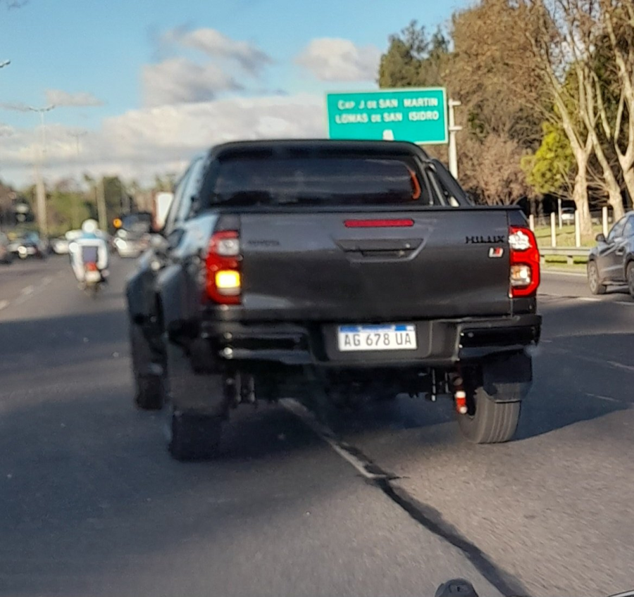
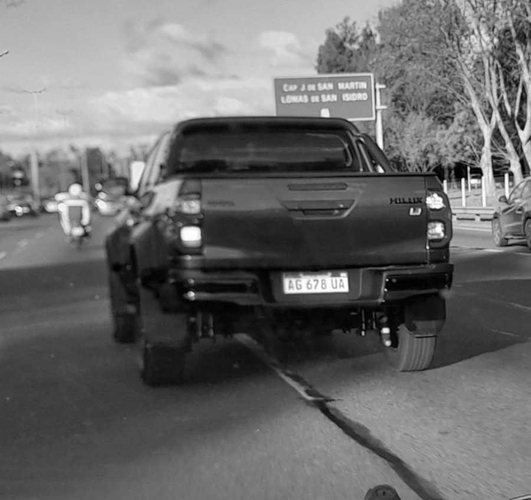
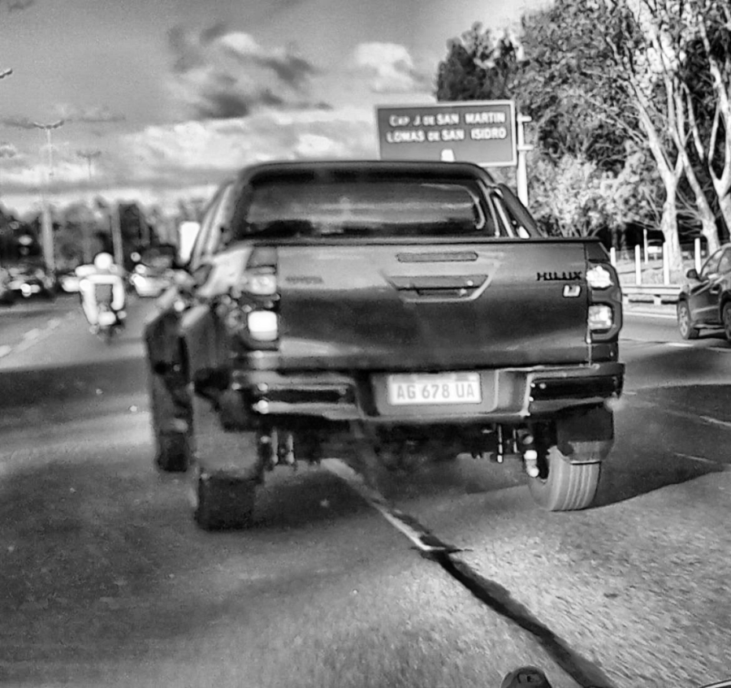
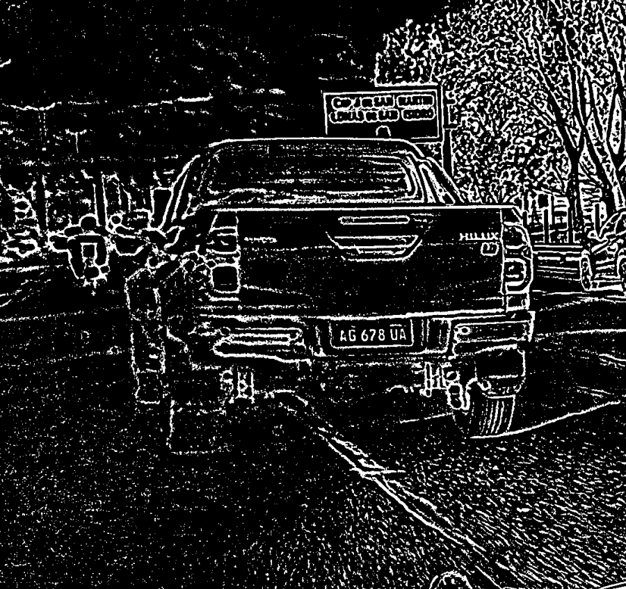
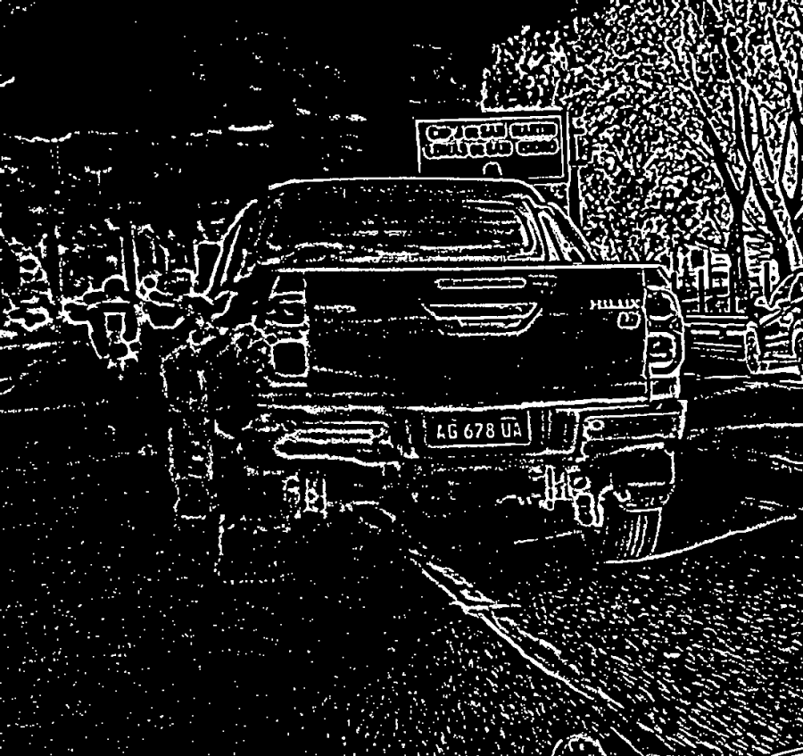
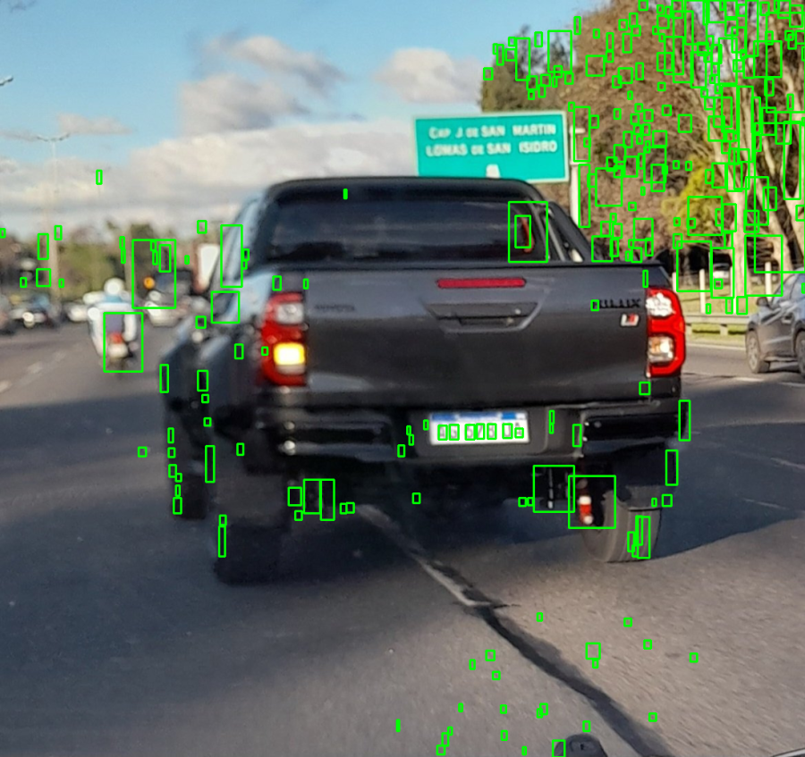
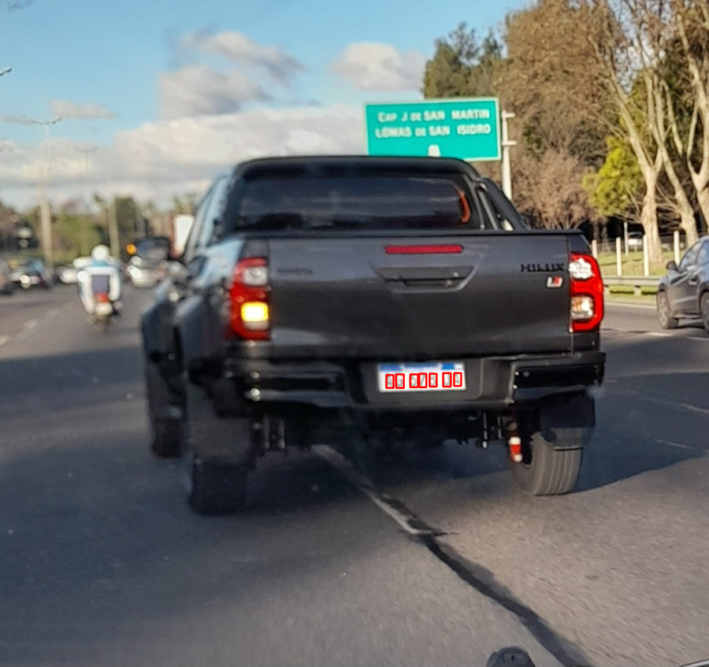
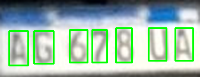

# Problema 2 — Detección de placas patente 🚗

Tenemos **12 fotos de autos** (vistos de frente o de atrás), cada uno con su
**patente argentina modelo Mercosur**. A partir de cada foto el programa debe:

1. **Localizar la patente** dentro de la imagen.
2. **Separar uno por uno los 7 caracteres** de la patente.

El desafío es que las fotos son muy distintas entre sí: patentes lejanas,
inclinadas, con sombras, distintos colores de auto y de fondo. Por eso, en lugar
de buscar "un rectángulo blanco", buscamos directamente **la fila de caracteres
que cumple la geometría oficial de una patente Mercosur**.

<p align="center">
  
  
</p>
<p align="center"><em>Izquierda: foto original · Derecha: patente localizada automáticamente.</em></p>

---

## 🧠 Cómo funciona, paso a paso

### 1) Preparar la imagen

La foto se **redimensiona** a un ancho fijo (para que patentes lejanas tengan
suficiente resolución), se pasa a **escala de grises** y se le aplica **CLAHE**,
una técnica que mejora el contraste de forma local. Esto hace que los caracteres
resalten incluso con sombras o iluminación despareja.

<p align="center">
  
  
</p>
<p align="center"><em>Grises → CLAHE (contraste local mejorado).</em></p>

### 2) Buscar candidatos a carácter

Con **umbralización adaptativa** (probando varias configuraciones) convertimos la
imagen a blanco y negro y, mediante **componentes conectados**, encontramos todas
las manchitas que *podrían* ser un carácter. Filtramos por tamaño y proporción
(los caracteres de una patente son **altos y angostos**), descartando todo lo
demás.

<p align="center">
  
  
  
</p>
<p align="center"><em>Umbral adaptativo → limpieza morfológica → candidatos tipo carácter.</em></p>

### 3) Elegir la fila correcta

Acá está el corazón del método. Agrupamos los candidatos en **filas** (caracteres
de altura parecida y alineados) y le damos un **puntaje** a cada fila según qué
tan bien encaja con una patente Mercosur real:

- ¿Tiene aproximadamente **7 caracteres**?
- ¿El **ancho total** es proporcional a la altura de los caracteres (≈ 5.85×)?
- ¿Los caracteres tienen el **ancho típico** (≈ 0.55× su altura)?
- ¿Están **espaciados de forma regular**?
- Bonus si debajo/arriba hay **fondo blanco** y la **franja azul** característica
  de las patentes Mercosur.

La fila con mejor puntaje gana, y a su alrededor se recorta la patente.

<p align="center">
  
</p>
<p align="center"><em>La fila de caracteres que mejor cumple la geometría de una patente.</em></p>

### 4) Segmentar los caracteres

Una vez recortada la patente, la volvemos a procesar (CLAHE + umbral) para
**aislar cada carácter por separado**, quedándonos con los 7 más coherentes en
tamaño y posición.

<p align="center">
  
</p>
<p align="center"><em>Los 7 caracteres de la patente, cada uno en su propia caja.</em></p>

---

## 🧩 Organización del código

El problema está separado en tres archivos, cada uno con una responsabilidad
clara:

| Archivo | Qué hace |
|---|---|
| `patentes.py` | **Script principal.** Recorre las 12 imágenes y coordina todo el proceso |
| `placa.py` | **Detección de la patente.** Busca la fila de 7 caracteres y recorta la chapa |
| `caracteres.py` | **Segmentación.** Separa los caracteres individuales dentro de la patente |
| `help_show.py` | Función auxiliar para mostrar imágenes |

---

## ▶️ Ejecución

Desde la raíz del repositorio:

```bash
uv run --directory ejercicio_2 python patentes.py
```

O bien, parado dentro de `ejercicio_2/`:

```bash
python patentes.py
```

Esto procesa las 12 imágenes de la carpeta `img/` e informa, para cada una, el
recuadro de la patente detectada y la cantidad de caracteres segmentados.

### 🔍 Modo debug

`patentes.py` se ejecuta con visualización activada (`debug=True`), por lo que
muestra, para cada foto, la **patente detectada sobre el original** y los
**caracteres segmentados**. Además, `placa.py` puede ejecutarse por separado
sobre una sola imagen para ver **todas las etapas internas** una por una:

```bash
python placa.py img/img_3.jpg
```

## 📂 Imágenes de entrada

12 fotos de vehículos en `img/` (`img_1.jpg` … `img_12.jpg`), cada una con su
patente Mercosur correspondiente.
